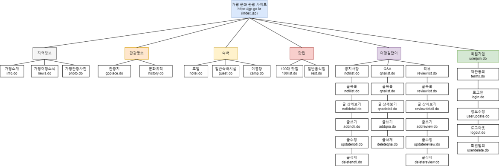
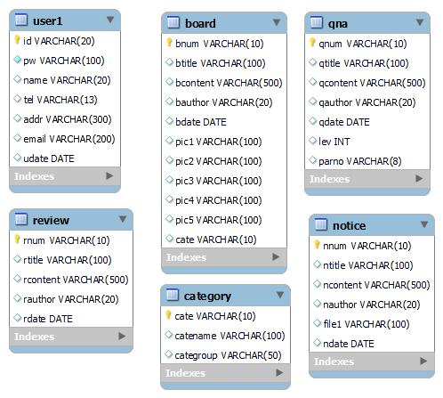
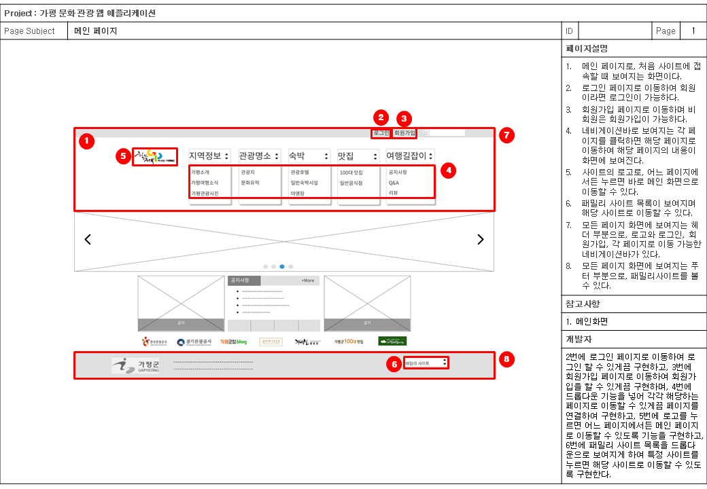
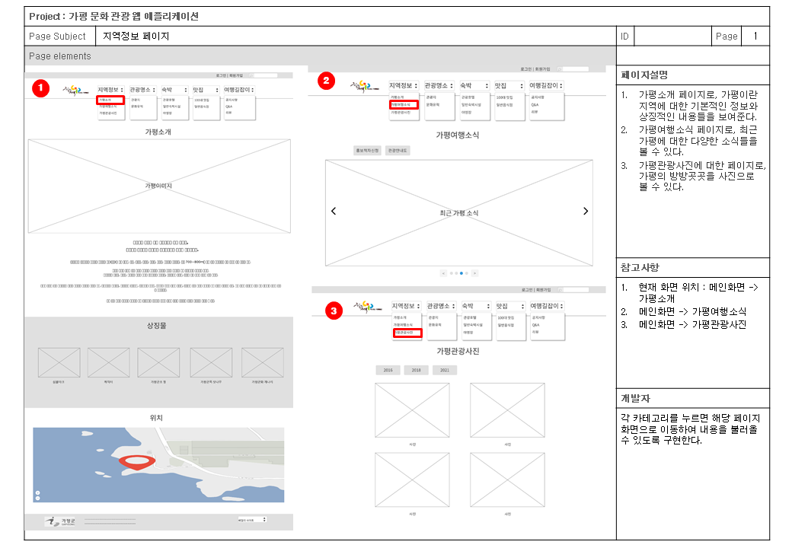
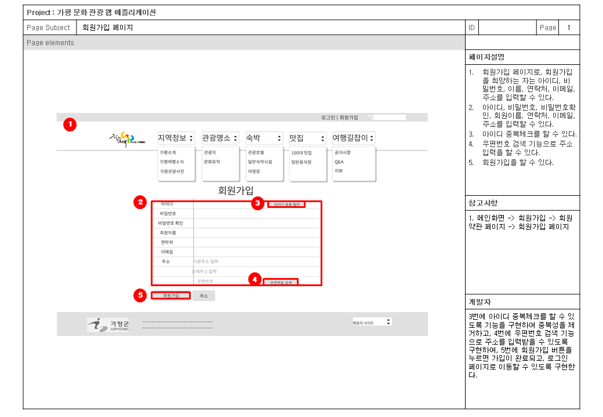
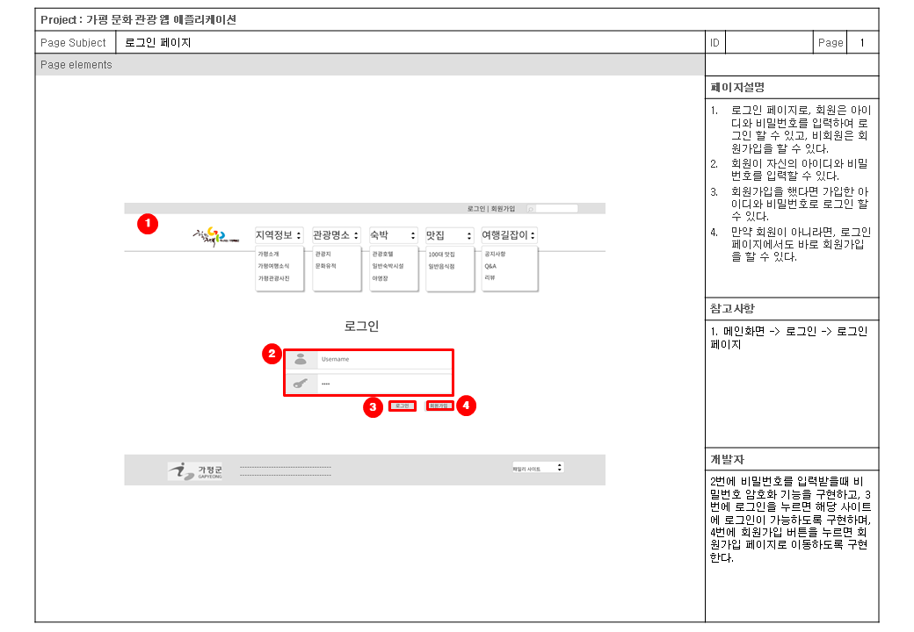
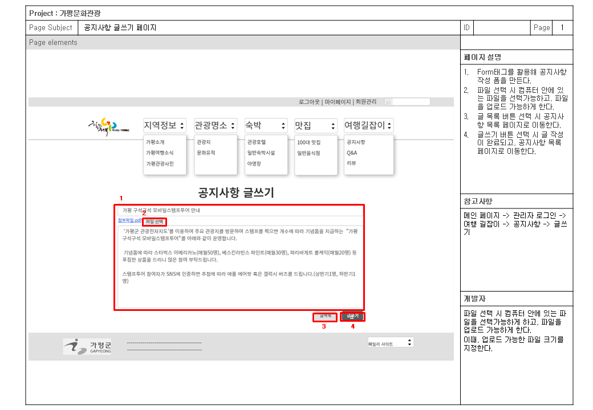
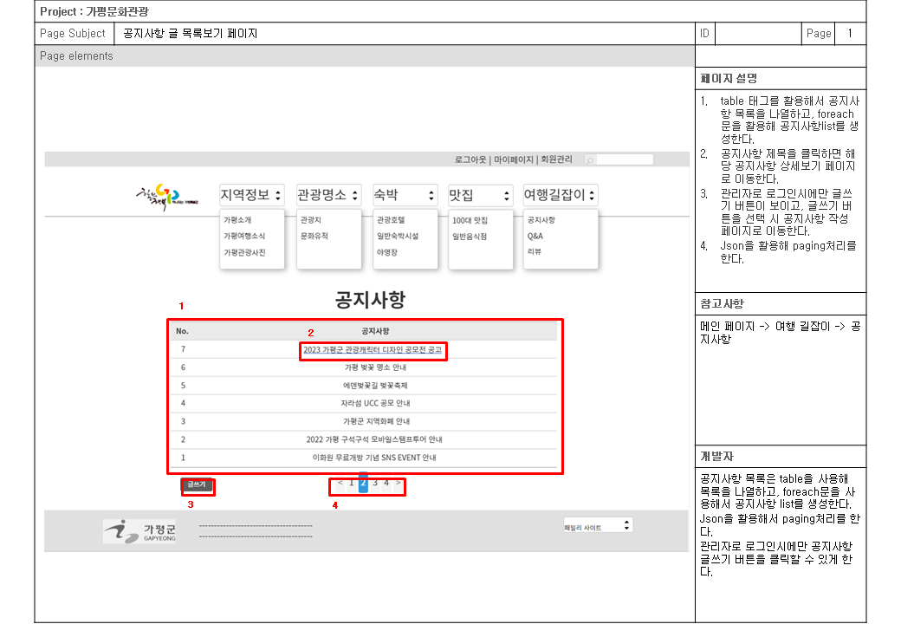

# 프로젝트 개요
https://jeniy01.github.io/web3

## 프로젝트 명 : 가평 문화 관광 홈페이지

## 프로젝트 기간 : 2023.05.17~05.31

## 프로젝트 참여 : 박지현, 전재영

## 자바 버전 : jdk 1.8

## 자바스크립트 버전 : 1.0

## 다이나믹 웹 모듈 : 3.1

## 사용 DBMS : MySQL 8

## 자바 사용 라이브러리 : crypto, json, cos, commons

## 통합 개발 도구(IDE) : eclipse Luna

## CSS 프레임워크 : bulma

## 자바스크립트 플러그인 : JQuery

## 자바스크립트 api : daum 주소 api, json 데이터 처리, iamport 결제 api

## 프로젝트 데이터 처리 패턴 : MVC2(View -> Controller -> Model -> Controller -> View)

## 프로젝트 주요 기능 : 회원, 공지사항, 질문 및 답변, 이용후기 등

## 프로젝트 특이 사항
- 회원 가입시 중복 체크는 json를 활용하여 별도의 팝업 창이 없이 현재 창에서 구현
- 회원 가입시 주소의 입력은 daum 주소 api를 활용하여 주소를 전달하여 구현
- 회원의 비밀번호는 md5, sha256, aes256 등으로 암호화하여 처리하여 구현
- 공지사항은 제목, 내용과 같이 파일 첨부 기능을 함께 구현
- 공지사항은 관리자만 등록, 수정, 삭제할 수 있도록 기능을 구현
- 공지사항 전체 목록의 페이징 처리 기능 구현
- 공지사항 글 상세보기 화면에서 해당 게시된 공지 중에서 파일 다운로드 기능 추가
- 후기 작성 시 첨부파일 업로드 기능을 함께 구현
- 후기 수정은 해당 내용을 작성한 회원만 수정할 수 있도록 구현
- 큐엔에이는 관리자와 로그인 한 회원만 글쓰기, 글수정, 글삭제가 가능하도록 구현
- 큐엔에이 질문 시, 질문 밑에 답변이 딸려 오도록 기능을 구현
- 관리자는 회원의 직권 등록, 직권 탈퇴, 정보 수정, 회원 정보 상세보기가 가능하도록 구현
- 관리자는 후기의 삭제와 목록보기가 가능하도록 구현
- 관리자는 큐엔에이의 답변 및 삭제가 가능하도록 구현
- 모든 목록은 페이징 처리가 가능하도록 구현
  

------------------------------------------------------------------------------------------------

# 프로젝트 설계

## 메뉴 설계도

## 물리적 ERD

  

------------------------------------------------------------------------------------------------

# 스토리보드
- 메인 페이지

- 서브 페이지

- 회원가입

- 로그인

- 글쓰기

- 글목록

